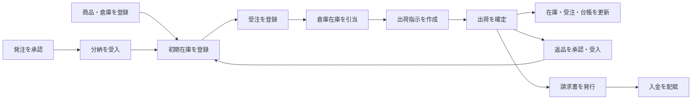

# HUMQ Sample

**Language:** [English](README.md) | 日本語

HUMQ の設計方針を、中規模の業務システムで検証するための B2B 受注・在庫・出荷管理サンプルです。

販売組織と取引先、商品・倉庫、調達、在庫台帳、受注、引当、出荷、返品、請求、入金までを一つの業務フローとして実装しています。

## 主な機能

- 組織、取引先、所属メンバー、住所の管理
- 商品カテゴリ、商品、取引先別単価、倉庫の管理
- 仕入先商品、発注点、補充提案、発注、分納、検品、入荷
- 在庫調整、倉庫別在庫、在庫台帳、倉庫間移動
- 受注登録、在庫引当、部分引当、キャンセル
- 出荷指示、出荷確定、追跡番号、受注・在庫への連動
- 返品可能数、返品承認、部分受入、再入庫・廃棄
- 出荷実績からの請求、請求発行、分割入金、入金配賦、売掛残高
- 業務ダッシュボード、監査ログ、Outbox イベント

## 業務フロー



## HUMQ

[github.com/kodaimura/humq](https://github.com/kodaimura/humq)

## 実装規模

- Python: 10,000 行以上（`api/app`、Alembic を含む）
- TypeScript / TSX: 約 3,700 行
- PostgreSQL: 42 テーブル
- Python 単体テスト: 69 件
- API E2E: 10 シナリオ

## 開発環境

Docker があれば起動できます。

```sh
git clone https://github.com/kodaimura/humq-sample.git
cd humq-sample
make demo
```

`make demo` はイメージのビルド、マイグレーション、デモデータ投入、アプリケーション起動を順番に実行します。デモデータだけを再実行する場合は `make seed` を使用できます。seed は再実行可能で、投入済みの場合はデータを重複作成しません。

### デモアカウント

`make demo` の完了後、以下のアカウントでWebアプリケーションへログインできます。

- ログインID: `demo@example.com`
- パスワード: `HumqDemo123!`
- 自社組織: `HUMQ製造株式会社`

### URL

- Web: http://localhost:3000
- API: http://localhost:8000/api
- OpenAPI: http://localhost:8000/docs
- Health: http://localhost:8000/health
- MailHog: http://localhost:8025

seed には日本語の商品20件、8倉庫、顧客3社、仕入先2社と、それらに紐づく在庫・補充基準を収録しています。自社だけでなく、すべての取引先組織に商品・倉庫・在庫・発注・受注を用意しているため、ヘッダーで組織を切り替えても業務データを確認できます。`HUMQ製造株式会社` では、下書き・一部引当・引当済み・出荷済み・取消済みの受注、下書き・分納中・入荷済みの発注、移動中・入庫済みの倉庫移動、返品、請求、一部入金・全額入金までを確認できます。

データを完全に作り直す場合は、開発用DBボリュームを削除してから再投入します。

```sh
make down_volumes
make demo
```

## テスト

```sh
make -C api format
make check
make -C api test_e2e
make -C api routes
```

API の E2E テストは、アカウント作成から在庫調整、受注、部分引当、キャンセル、倉庫間移動、出荷確定に加え、補充提案、発注、分納、返品、請求、分割入金、売掛残高までを通して検証します。

## ディレクトリ

- `api/`: FastAPI、SQLAlchemy、Alembic、HUMQ の Module / Query / Usecase
- `web/`: React、TypeScript による業務コンソール

ベースプロジェクトは [webscaf](https://github.com/kodaimura/webscaf) の `fast-react` パターンを利用しています。
