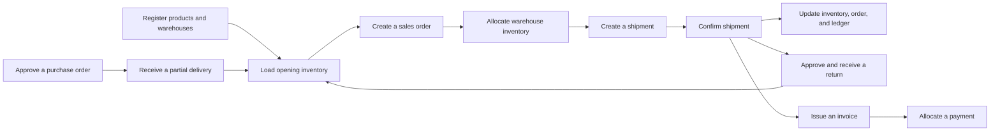

# HUMQ Sample

**Language:** English | [日本語](README.ja.md)

A B2B order, inventory, and shipping management sample for validating HUMQ's design principles in a medium-scale business system.

It implements a single end-to-end business flow covering selling organizations and counterparties, products and warehouses, procurement, inventory ledgers, sales orders, allocation, shipping, returns, invoicing, and payments.

## Features

- Organizations, counterparties, members, and addresses
- Product categories, products, customer-specific pricing, and warehouses
- Supplier products, reorder points, replenishment recommendations, purchase orders, partial deliveries, inspection, and receiving
- Inventory adjustments, warehouse inventory, inventory ledgers, and warehouse transfers
- Sales order entry, inventory allocation, partial allocation, and cancellation
- Shipment creation, shipment confirmation, tracking numbers, and order/inventory updates
- Return eligibility, return approval, partial receipt, restocking, and disposal
- Shipment-based invoicing, invoice issuance, split payments, payment allocation, and receivables
- Operations dashboard, audit logs, and Outbox events

## Business Flow



## HUMQ

[github.com/kodaimura/humq](https://github.com/kodaimura/humq)

## Project Size

- Python: 10,000+ lines, including `api/app` and Alembic
- TypeScript / TSX: approximately 3,700 lines
- PostgreSQL: 42 tables
- Python unit tests: 59
- API E2E scenarios: 10

## Getting Started

Docker is the only prerequisite.

```sh
git clone https://github.com/kodaimura/humq-sample.git
cd humq-sample
make demo
```

`make demo` builds the images, runs database migrations, loads the demo data, and starts the application. Run `make seed` to load only the demo data. The seed command is idempotent and does not duplicate existing demo data.

### Demo Account

After `make demo` completes, sign in to the Web application with:

- Login ID: `demo@example.com`
- Password: `HumqDemo123!`
- Primary organization: `HUMQ製造株式会社`

### URLs

- Web: http://localhost:3000
- API: http://localhost:8000/api
- OpenAPI: http://localhost:8000/docs
- Health: http://localhost:8000/health
- MailHog: http://localhost:8025

The seed contains 20 products with Japanese names, 8 warehouses, 3 customers, 2 suppliers, and their associated inventory and replenishment settings. Products, warehouses, inventory, purchase orders, and sales orders are available for every counterparty organization, so switching organizations in the header always displays business data. `HUMQ製造株式会社` includes draft, partially allocated, allocated, shipped, and canceled sales orders; draft, partially received, and received purchase orders; in-transit and received warehouse transfers; returns; invoices; and partially and fully paid transactions.

To recreate all data, remove the development database volume and run the demo again.

```sh
make down_volumes
make demo
```

## Testing

```sh
make -C api format
make check
make -C api test_e2e
make -C api routes
```

The API E2E suite covers account creation, inventory adjustments, sales orders, partial allocation, cancellation, warehouse transfers, shipment confirmation, replenishment recommendations, purchase orders, partial deliveries, returns, invoicing, split payments, and receivables.

## Directories

- `api/`: FastAPI, SQLAlchemy, Alembic, and the HUMQ Modules, Queries, and Usecases
- `web/`: Operations console built with React and TypeScript

The project is based on the `fast-react` pattern from [webscaf](https://github.com/kodaimura/webscaf).
