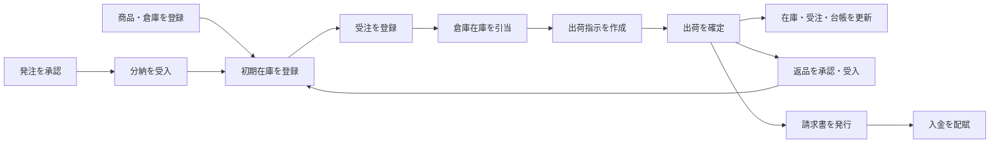
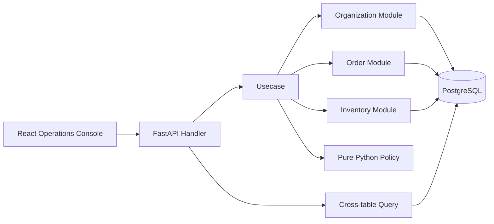

# HUMQ Flow

HUMQ の設計方針を、中規模の業務システムで検証するための B2B 受注・在庫・出荷管理サンプルです。

販売組織と取引先、商品・倉庫、調達、在庫台帳、受注、引当、出荷、返品、請求、入金までを一つの業務フローとして実装しています。データベースは認証を含む 42 テーブル、バックエンドの Python コードは 10,000 行以上で構成しています。

## 主な機能

- 組織、取引先、所属メンバー、住所の管理
- 商品カテゴリ、商品、取引先別単価、倉庫の管理
- 仕入先商品、発注点、補充提案、発注、分納、検品、入荷
- 在庫調整、倉庫別在庫、在庫台帳、倉庫間移動
- 受注登録、在庫引当、部分引当、キャンセル
- 出荷指示、出荷確定、追跡番号、受注・在庫への連動
- 返品可能数、返品承認、部分受入、再入庫・廃棄
- 出荷実績からの請求、請求発行、分割入金、入金配賦、売掛残高
- 業務ダッシュボード、監査ログ、Outbox イベント

## 業務フロー



## HUMQ アーキテクチャ

書き込み処理は `Handler -> Usecase -> Module`、複数テーブルを横断する読み取りは `Query`、DB に依存しない金額・数量・状態判定は `Policy` に分離しています。Module は原則として一つのテーブルを担当し、トランザクション境界は Usecase が所有します。



代表的な一連の処理で、以下を確認できます。

- 受注確定時に複数倉庫の利用可能在庫を検索し、引当を作成する
- 出荷確定時に引当を消し込み、実在庫と在庫台帳を同一トランザクションで更新する
- 受注・出荷の状態遷移履歴と監査ログを残す
- 外部連携用イベントを Outbox に保存する
- 発注の分納、返品の再入庫・廃棄、複数請求への入金配賦をトランザクション内で処理する
- Policy を DB なしで単体テストし、Usecase は永続化と業務フローの調整に集中する

## テーブル構成

| 領域 | テーブル | 数 |
| --- | --- | ---: |
| 認証 | `account`, `password_reset_token` | 2 |
| 組織 | `organization`, `organization_member`, `organization_address` | 3 |
| 商品 | `product_category`, `product`, `customer_product_price` | 3 |
| 在庫 | `warehouse`, `inventory_balance`, `inventory_ledger`, `inventory_adjustment`, `inventory_adjustment_item`, `inventory_transfer`, `inventory_transfer_item` | 7 |
| 受注 | `sales_order`, `sales_order_item`, `sales_order_status_history`, `stock_reservation` | 4 |
| 出荷 | `shipment`, `shipment_item`, `shipment_status_history` | 3 |
| 調達 | `supplier_product`, `reorder_policy`, `purchase_order`, `purchase_order_item`, `purchase_order_status_history`, `goods_receipt`, `goods_receipt_item`, `goods_receipt_status_history` | 8 |
| 返品 | `sales_return`, `sales_return_item`, `sales_return_status_history`, `return_receipt`, `return_receipt_item` | 5 |
| 請求 | `invoice`, `invoice_item`, `invoice_status_history`, `payment`, `payment_allocation` | 5 |
| 基盤 | `outbox_event`, `audit_log` | 2 |
| 合計 |  | **42** |

## 実装規模

- Python: 10,000 行以上（`api/app`、Alembic を含む）
- TypeScript / TSX: 約 3,700 行
- PostgreSQL: 42 テーブル
- Python 単体テスト: 44 件
- API E2E: 9 シナリオ

フロントエンドの画面数を増やすことではなく、サーバー側の業務ルール、状態遷移、排他制御、横断トランザクションを厚くする構成です。

## 開発環境

Docker があれば起動できます。

```sh
make build
make up
make migrate
```

- Web: http://localhost:3000
- API: http://localhost:8000/api
- OpenAPI: http://localhost:8000/docs
- Health: http://localhost:8000/health
- MailHog: http://localhost:8025

サインアップ後、最初に `/organizations` で自社組織と取引先を作成してください。ヘッダーで自社組織を選ぶと、商品・在庫・受注・出荷の各画面を操作できます。

## テスト

```sh
make check
make -C api test_e2e
make -C api routes
```

API の E2E テストは、アカウント作成から在庫調整、受注、部分引当、キャンセル、倉庫間移動、出荷確定に加え、補充提案、発注、分納、返品、請求、分割入金、売掛残高までを通して検証します。

## ディレクトリ

- `api/`: FastAPI、SQLAlchemy、Alembic、HUMQ の Module / Query / Usecase
- `web/`: React、TypeScript による業務コンソール

ベースプロジェクトは [webscaf](https://github.com/kodaimura/webscaf) の `fast-react` パターンを利用しています。
